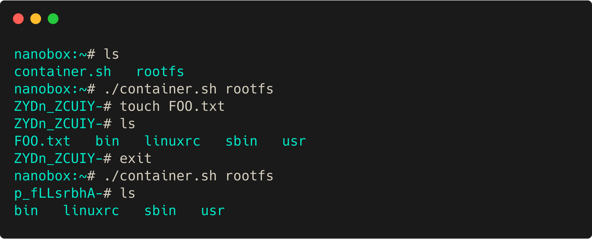
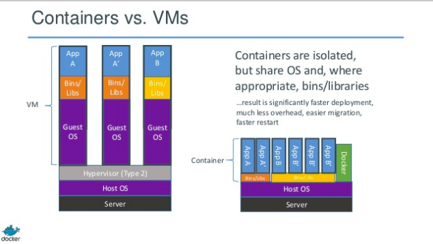

# Containers

In this workshop, we will be exploring concepts related to containers in depth, first by manually constructing a container, and then by relating to those concepts features available in Docker.

## Preqs

You must be able to pass the `opunit` checks for virtualization, and have `bakerx`, and `VirtualBox` installed.

You can *import* this workshop as a notebook, or manually run the instructions in a terminal and editor.

```bash
docable-server import https://github.com/CSC-DevOps/Containers
```

## A Simple Container

We will create a simple container using `chroot`. 

Pull an 3.9 alpine image and create a VM called, `containers`.

```bash | {type: 'command'}
bakerx pull alpine3.9-simple ottomatica/slim#images
```

```bash | {type: 'command'}
bakerx run containers alpine3.9-simple
```

### Prepare a simple rootfs with busybox.

```bash
mkdir -p rootfs/bin rootfs/sbin rootfs/usr/bin rootfs/usr/sbin

wget https://www.busybox.net/downloads/binaries/1.31.0-defconfig-multiarch-musl/busybox-i686 -O rootfs/bin/busybox
chmod +x rootfs/bin/busybox
```

Install symlinks inside the rootfs
```bash
chroot rootfs /bin/busybox --install -s
```

### Playing with container

Let's try it out!

```bash
PS1="C-$ " chroot rootfs /bin/busybox sh
C-$ touch HELLO.txt
C-$ ls
C-$ exit
```

There is a minor problem. We have not perserved the isolation property for our filesystem, as the filesystem is still mutable.

You can see new file exists in the file system, and worse, we can delete and mess up things.
```bash
PS1="C-$ " chroot rootfs /bin/busybox sh
ls
rm HELLO.txt
```

### Introducing overlay filesystem

Create a new [container.sh](container.sh) file inside your micro VM and make it exectuable.
This script will create a new snapshot of the filesystem everytime is it launched in order to run the container.

```bash
#!/bin/ash

# Expect rootfs as script argument
ROOTFS=$1

# Create a random unique string
nonce=$(</dev/urandom tr -dc A-Za-z0-9-_ | head -c 10)

# Prepare our filesystem for our container.
mkdir -p /tmp/$nonce/upper /tmp/$nonce/workdir /tmp/$nonce/overlay
# Create an overlay filesystem based on our read-only root filesystem.
mount -t overlay -o lowerdir=$ROOTFS,upperdir=/tmp/$nonce/upper,workdir=/tmp/$nonce/workdir none /tmp/$nonce/overlay

# Create symlinks in our container for convience.
chroot /tmp/$nonce/overlay/ /bin/busybox --install -s

# Launch container with custom prompt in ash shell.
PS1="$nonce-# " chroot /tmp/$nonce/overlay /bin/busybox sh
```

Using the overlay filesystem, we can keep our rootfs "read-only", while allowing new changes to be made. The read-only portion is denotated by the "lower" directory. The change states are maintained in the "upper" and "work" directories, and the merged/unified filesystem is available in the "overlay" directory.

A short demo of the script illustrates our ability to perserve the rootfs each time we create a new container.

<p align="center">

</p>

### Summary

While we have demonstrated a very simple way to implement containers---however, there are several limitations with our implementation.

* Preparing root file systems can be problematic. Can we do better than random wget scripts?
* Keeping multiple root filesystems can be inefficient --- We are not taking advantage of common shared files.
* Other devices of the host OS are not isolated, such as networking.
* We may want to share and isolate other resources with the host. For example, if we mount the proc filesystem, we can kill any process on the system. Not good! A rogue container could interfere with other containers or bring down the whole system.

  ```bash
  mkdir -p /tmp/$nonce/overlay/proc
  mount -t proc none /tmp/$nonce/overlay/proc
  ```

## Introducing Docker containers.

If we worked on our script for several more years and took advantage of other capabilities of the Linux kernel, such as cgroups and namespaces, we could overcome many of the limitations we saw with our homegrown containers. Thankfully, someone has done this work for us.

### Setup 

#### Create a headless micro VM with bakerx

Pull an ubuntu bionic image and create a micro VM called, `docker0`.

```bash
bakerx pull cloud-images.ubuntu.com bionic
bakerx run docker0 bionic
```

#### Install docker inside your VM.

The recommended method for installing docker on ubuntu can be [found here](https://docs.docker.com/install/linux/docker-ee/ubuntu/#install-docker-ee-1).  But in the interest of time: :grimacing:

```
curl -sSL https://get.docker.com/ | sh
```

After installation, it is recommended you allow docker to be run without needing sudo. **IMPORTANT** You'd need to restart your shell (exit and log back in) to see the changes reflected.

```
sudo usermod -aG docker $(whoami)
```

Verify you can run docker:
```
docker run hello-world
```

### Playing with Docker

Pull an ubuntu image.

```
$ docker pull ubuntu:18.04
```

Check the size of the images.

```bash
$ docker images
REPOSITORY          TAG                 IMAGE ID            CREATED             SIZE
ubuntu              18.04               ccc6e87d482b        6 days ago          64.2MB
hello-world         latest              fce289e99eb9        12 months ago       1.84kB
```

Let's create a simple container.

```bash
docker run ubuntu:18.04 sh
```

Unfortunately, that doesn't quite do what we want, because a pseudo-tty allocated to the container, so we can use the terminal.

```
$ docker run -t ubuntu:18.04 sh
# ls

exit
.exit
^C
```

Unfortunately, that's still not enough. Docker isn't necessarily the most intuitive system, you see. You also need to allow input (`-i` Keep STDIN open even if not attached).

```
$ docker run -it ubuntu:18.04 sh
```

Finally, we can get to a terminal, and see we can run shell commands in our own private snapshot of the ubuntu image.


```bash
$ docker run -it ubuntu:18.04 sh
# ls
# rm -rf --no-preserve-root /
# exit
```

Oh no, what have we done? Is everything okay?

```bash
$ docker run -it ubuntu:18.04 sh
```

### Building Images

We can create our own images.
Create a "Dockerfile" and place this content inside:

```
FROM ubuntu:18.04

RUN apt-get -y update

# update packages and install
RUN apt-get install -y openjdk-11-jre-headless wget curl unzip

RUN apt-get -y install git
RUN apt-get -y install maven

ENV JAVA_HOME /usr/lib/jvm/java-11-openjdk-amd64
```

Build the docker image, and name it "java11".

```bash
docker build -t java11 .
```

We can see our image listed, now:

```bash
docker images
```

Now, let's use it to run `mvn` to check our environment setup.

```bash
docker run java11 mvn --version
```

### Understanding containers

Look at all the containers you've created by running commands above.

```
docker ps -a 
```

The container "graveyard" contains all the dead containers that ran a process, then exited.
If we want a container to stick around, we need it to run in daemon mode, but adding the `-d` arg. We also provide a name for easy reference.

```
docker run --name test-d -it -d ubuntu:18.04
```

Let's use an one-liner to write a file to our running container.

```bash
docker exec -it test-d script /dev/null -c "echo 'Hello' > foo.txt"
```

Make sure we can see change. Note we add `-t` to improve the output of `ls`:

```bash
docker exec -t test-d ls
```

Now, let's commit this to our image. Any new container will now have 'foo.txt' inside it.

```bash
docker commit test-d ubuntu:18.04
```

We can confirm that new containers do indeed have 'foo.txt' inside:

```bash
$ docker run -t ubuntu:18.04 ls
bin   dev  foo.txt  lib    media  opt	root  sbin  sys  usr
boot  etc  home     lib64  mnt	  proc	run   srv   tmp  var
```

### Volumes

Imagine you wanted to create a simple build script and run against an image. It could be incredible tedious to create a new image per project, just to add the build script. Furthermore, getting data *out* of a container could be unwieldy. Alternatively, we can use volumes, to share our filesystem of our host with a container.

```
docker run -v /home/vagrant/:/vol java11 ls -a /vol/
```

We should be able to see our host's directory home directory. Now, we can have a simple "escape hatch" to get data in and out of the container at the cost of losing true immutability. 

### Build script demo

In your host VM, create 'build.sh' and place the following inside:

```bash
git clone https://github.com/CSC-326/JSPDemo
cd JSPDemo
mvn compile -DskipTests -Dmaven.javadoc.skip=true
```

```
chmod +x build.sh
docker run -v /home/vagrant/:/vol java11 sh -c /vol/build.sh
```

We can confirm the code is greatly out of date and does not work with Java 11!
```
[INFO] 31 errors 
[INFO] -------------------------------------------------------------
[INFO] ------------------------------------------------------------------------
[INFO] BUILD FAILURE
[INFO] ------------------------------------------------------------------------
[INFO] Total time:  29.052 s
[INFO] Finished at: 2020-01-22T22:06:57Z
[INFO] ------------------------------------------------------------------------
```

### Reviewing principles

Recall we want to maintain efficiency and isolation. Here is how Docker enables this.



##### Images

* A docker image contains a set of layers, which can be composed for efficient storage on the system.
* An image can be based on other images (`FROM ubuntu:18.04`).
* You can build your own images by running commands inside a Dockerfile. 
* A base image is usually created with hand-crafted rootfs (`FROM scratch` ... `COPY /rootfs /`).
* More advanced ways to build images, include using the [Builder pattern](https://matthiasnoback.nl/2017/04/docker-build-patterns/), for multi-staged builds.

##### Containers

* A container contains an overlay of the image's rootfs.
* Containers are generally stateless, that is any change to a container has no effect on its image; however, you can commit a change to a new image.
* A docker container only stays alive as long as there is an active process being run in it. You can keep a long running container by running a process that does not exist (a server), or running in daemon mode (`-d`).
* A container cannot generally access other processes, the host filesystem, or other resources. The entry point is PID 1. 
* While greatly useful, running programs inside containers can result in many different quirky behavior.

